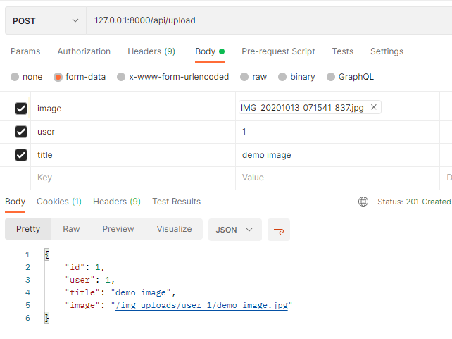
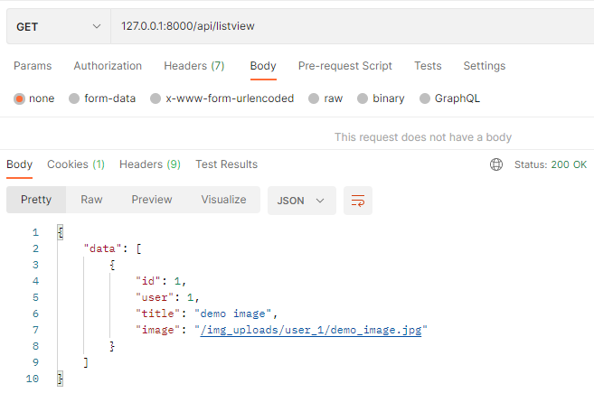
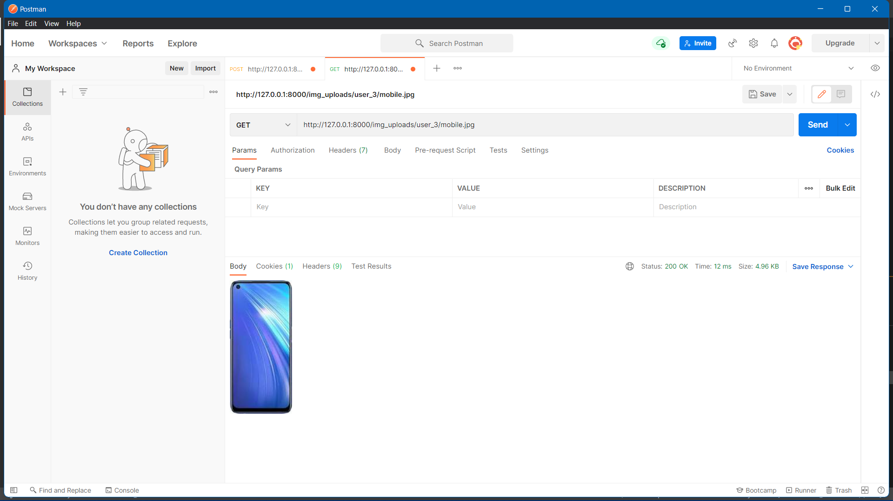

<div align="center">

# File-Auth

Codepeak 2021 Open source 
<p align="center">
    <a href="https://www.codepeak.tech/">
      
    </a>
    <a href="https://github.com/RupakBiswas-2304/File_authentication/issues">
      
    </a>
    <a href="https://github.com/RupakBiswas-2304/File_authentication/pulls">
      
    </a>
  </p>
  <br/>
<!-- [](https://www.codepeak.tech/) -->


 <br/>


[](https://code.visualstudio.com/)
[](https://github.com/File_authentication)
<br/>
A secure-authentication system which verifies users by verifying an uploaded file.

# Api Documentation:
</div>

## Endpoints:-

### 1 Register
- For registering a new user
- URL
  ```http
  POST /api/register
  ```
- Request body structure

  | Parameter | Type | Required | Description |
  | :--- | :--- | :--- | :--- |
  | `name` | `string` | **Required**| Your Name |
  | `email` | `string` | **Required**| Your Email |
  | `password` | `string` | **Required**| Your password |
  | `file` | `filetype` | **Required**| Your File |
  | `phoneno` | `string` | **Required**| Your Phone Number |

- Example Input
  ```javascript
  {
    "fname" : "demo",
    "lname" : "demo"
    "email" : "demo@gmail.com",
    "phoneno" : 9999999999
    "file" : "demofile"
  }
  ```
- Example Response on success
  ```javascript
  {
      "serializer" : {
        "fname" : "demo",
        "lname: : "demo",
        "email" : "demo@gmail.com",
        "phoneno" : 9999999999
        "file" : "demofile"
      }
      "status" : 201,
      "message" : "User Created Successfull"
  }
  ```

- Example Response on using registered email
  ```javascript
  {
      "status" : 403,
      "message" : "user with that email exists",
  }
  ```

- Example Response on something going wrong
  ```javascript
  {   
      "status":400,
      "message": "User not created",
  }
  ```

### 2 Login
- For logging in a user
- URL
  ```http
  POST /api/login
  ```
- Request body structure

  | Parameter | Type | Required | Description |
  | :--- | :--- | :--- | :--- |
  | `email` | `string` | **Required**| Your Email |
  | `file` | `filetype` | **Required**| Your file |

- Example Input
  ```javascript
  {
    "email" : "demo@gmail.com",
    "file" : "demofile",
  }
  ```
- Example Response on success
  ```javascript
  {
      "message" : "Successfully logged in",
      "status" : 200
  }
  ```
- Example Response on Wrong File
  ```javascript
  {
      'message':"You have Choosen Incorrect File",
      'status':403
  }
  ```
- Example Response on Wrong Email
  ```javascript
  {
      "message" : "No User found",
      "status" : 403
  }
  ```
- Remarks:
  - *jwt token* is saved in Cookies and sent to server on every request
  - if the token expires/is_invalid, then we have to login again

### 3 Get User Details
- For getting user data
- URL
  ```http
  GET /api/user
  ```
- Request body structure

  | Parameter | Type | Required | Description |
  | :--- | :--- | :--- | :--- |
  | `none` | `none` | | none |

- Example Input
  ```javascript
  {}
  ```
- Example Response on success
  ```javascript
  {
      "message" : {
          "id" : 1,
          "name" : "demo",
          "email" : "demo@gmail.com",
          "age" : 19,
          "phoneno" : 9999999999
        },
      "status" : 200
  }
  ```
- Remarks:
  - server send your user details by analysing your jwt token which is automatically send in cookies

### 4 Update User Details
- For updating user data
- URL
  ```http
  POST /api/profile
  ```
- Request body structure

  | Parameter | Type | Required | Description |
  | :--- | :--- | :--- | :--- |
  | `name` | `string` | **Not Required**| Your Name |
  | `age` | `string` | **Not Required**| Your Age |
  | `phoneno` | `string` | **Not Required**| Your Phone Number |

- Example Input
  ```javascript
  {
    "name" : "demo updated",
    "age" : 20,
  }
  ```
- Example Response on success
  ```javascript
  {
      "message": "Your Profile Updated Successfully",
      "status":200
  }
  ```

### 5 Logout
- For Signing out the current logged in user
- URL
  ```http
  POST /api/logout
  ```
- Request body structure

  | Parameter | Type | Required | Description |
  | :--- | :--- | :--- | :--- |
  | `none` | `none` |  | none |

- Example Input
  ```javascript
  {}
  ```
- Example Response on success
  ```javascript
  {
      "message" : "success"
  }
  ```
- Remarks:
  - on logout, the jwt token is deleted from Cookies.
  
### 6 Upload an Image
- For Uploading the images
- URL
  ```http
  POST /api/upload
  ```
- Request body structure

  | Parameter | Type | Required | Description |
  | :--- | :--- | :--- | :--- |
  | `user` | `int` | **Required** | user id |
  | `title` | `string` | **Required** | image name |
  | `image` | `image` | **Required** | image to be uploaded |

- Example Input and Response

  

### 7 List all Images
- For Listing all the images
- URL
  ```http
  GET /api/listview
  ```
- Request body structure

  | Parameter | Type | Required | Description |
  | :--- | :--- | :--- | :--- |
  | `none` | `none` |  | none |

- Example Input and Response

  

### 8 Deleting a Image
- For Deleting the images
- URL
  ```http
  POST /api/deleteimage
  ```
- Request body structure

  | Parameter | Type | Required | Description |
  | :--- | :--- | :--- | :--- |
  | `id` | `int` | **Required** | id of image |
  | `image` | `string` | **Required** | id of image |

- Example Input and Response
  
- Example Response on mismatch of user & image relation
  ```javascript
  {
      "message":"Can't delete other user's image"
  }
  ```
### 9 Downloading a Image
- For Downloading the images
- URL
  ```http
  GET /img_uploads/<path:relative_path>
  ```
- Request body structure

  | Parameter | Type | Required | Description |
  | :--- | :--- | :--- | :--- |
  | `none` | `none` |  | none |

- Example Input and Response
  
